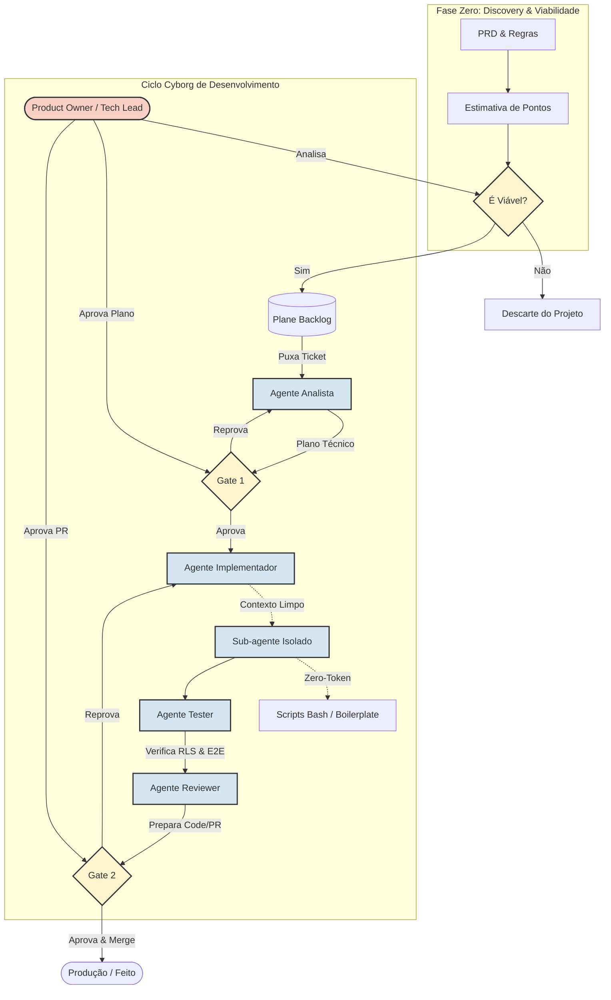

# Workflow: Metodologia Cyborg (IA + Humano)

Este diagrama representa o fluxo de vida completo de uma funcionalidade, desde a ideação (Fase Zero) até o código em produção, destacando os "Gates" de aprovação humana e as estratégias de otimização de contexto para a IA.

